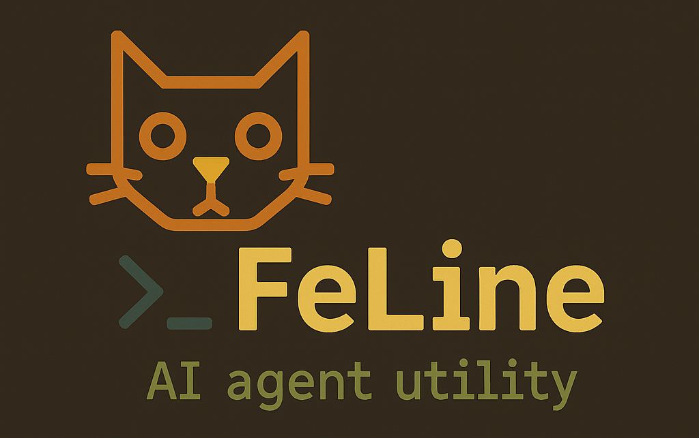

## FeLine - A command-line client for AI models.


### Introduction
FeLine is a powerful command-line interface (CLI) tool designed for seamless interaction with AI language models. It stands out by allowing you to directly integrate the output of your terminal (Bash, PowerShell, CMD) commands into your AI conversations. This enables dynamic scenarios where you can get real-time system information, analyze data, run scripts, and much more, all within a natural conversational flow.

### Key Features
*   **Shell Command Integration:** Execute terminal commands directly within your prompts and feed their output to the AI.
*   **Image Processing:** Incorporate local image files into your conversations for visual analysis and description.
*   **Interactive Chat Mode:** Engage in persistent conversations with the AI model.
*   **Flexible Model Selection:** Choose between different available AI models (e.g., `gemini-flash`, `gemini-pro`).

---

### Prerequisites
Before installing FeLine, ensure you have the following:

1.  **Google AI Studio API Key:**
    *   Obtain your API key from the Google AI Studio platform: [aistudio](https://aistudio.google.com/app/apikey)
    *   This key is essential for FeLine to authenticate with the AI models.

2.  **Python 3:**
    *   Install the appropriate Python 3 version for your operating system: [python](https://www.python.org/downloads/)

---

### Installation

This section guides you through downloading FeLine, setting up its Python environment, and configuring your system for easy access.

#### 1. Download FeLine Project

Choose the method that suits your operating system:

**On Unix-based systems (Linux, macOS):**
```bash
# Using curl to download, extract, and move FeLine to /opt/
curl -L -o FeLine.zip https://github.com/vizard418/FeLine/archive/refs/heads/main.zip && \
unzip FeLine.zip -d . && mv FeLine-main FeLine && rm FeLine.zip
```

**On Windows (PowerShell):**
```powershell
# Using Invoke-WebRequest to download and extract
Invoke-WebRequest -Uri "https://github.com/vizard418/FeLine/archive/refs/heads/main.zip" -OutFile "FeLine.zip"; Expand-Archive -Path "FeLine.zip" -DestinationPath "FeLine" -Force; Remove-Item "FeLine.zip"
```
*Note: For Windows, consider moving the `FeLine` folder to a more standard location like `C:\Program Files\FeLine` after extraction.*

#### 2. Set Up Python Virtual Environment & Dependencies

A virtual environment ensures that FeLine's dependencies don't conflict with other Python projects.

*   **Install `virtualenv` and create the environment:**
    ```shell
    python3 -m pip install virtualenv
    cd FeLine/  # Or cd FeLine if on Windows in the downloaded folder
    python3 -m virtualenv env
    ```

*   **Activate environment & install dependencies:**

    **On Unix-based systems:**
    ```bash
    source env/bin/activate && python -m pip install -r requirements.txt && deactivate
    ```

    **On Windows:**
    ```powershell
    env\Scripts\activate
    python -m pip install -r requirements.txt
    deactivate
    ```

#### 3. Configure API Key and Add to PATH

For FeLine to function, you need to set your Google AI Studio API key and add the FeLine directory to your system's PATH.

*   **On Unix-based systems (Linux, macOS):**
    Add the following lines to your shell configuration file (e.g., `~/.bashrc`, `~/.profile`, `~/.bash_profile`). Remember to replace `[YourApiKey]` with your actual API key.
    ```bash
    # FeLine (A command-line AI agent)
    export GEMINI_API_KEY="[YourApiKey]"
    export PATH="$PATH:~/FeLine"
    ```
    *   **Important:** After modifying your configuration file, reload it:
        ```bash
        source ~/.bashrc # Or ~/.profile, depending on which file you edited
        ```

*   **On Windows:**
    You need to modify your system's environment variables.
    1.  Search for "Environment Variables" in the Start menu and select "Edit the system environment variables."
    2.  Click "Environment Variables..."
    3.  Under "User variables" or "System variables," click "New" to add `GEMINI_API_KEY` with your API key as its value.
    4.  Edit the `Path` variable to add the full path to your FeLine installation directory (e.g., `C:\Program Files\FeLine` or `C:\Users\YourUser\FeLine`).

---

### Basic Usage

Once installed and configured, you can start using FeLine.

*   **Start an interactive chat session:**
    ```bash
    feline -it
    ```
    This will launch FeLine's interactive mode, allowing you to converse with the AI.

*   **View help documentation:**
    ```bash
    feline --help
    ```
    This command displays all available options and flags for FeLine.

---

### Advanced Usage: Integrating with `$`

FeLine leverages the `$` symbol as a special instruction prefix within your prompts, allowing it to interact with your local environment.

#### Shell Command Integration

Use `$()` to execute shell commands and feed their output directly into your AI prompt. This is incredibly useful for providing real-time context from your system.

*   **Single-Line Command Prompts:**
    You can embed a shell command directly within a single prompt for immediate execution and AI processing.

    *   **On Unix-based systems (e.g., `cat` command):**
        ```bash
        feline "Summarize the key statements from my notes. $(cat notes.md)"
        ```
    *   **On Windows CMD (e.g., `type` command):**
        ```cmd
        feline "Summarize the key statements from my notes. $(type notes.md)"
        ```

*   **Interactive Mode with Shell Commands:**
    In interactive mode, you can type your prompt, and FeLine will execute the command before sending the full context to the AI.
    *   **Example (Unix-based `ls -l`):**
        ```bash
        feline -it
        ███████╗███████╗██╗     ██╗███╗   ██╗███████╗
        ██╔════╝██╔════╝██║     ██║████╗  ██║██╔════╝
        █████╗  █████╗  ██║     ██║██╔██╗ ██║█████╗
        ██╔══╝  ██╔══╝  ██║     ██║██║╚██╗██║██╔══╝
        ██║     ███████╗███████╗██║██║ ╚████║███████╗
        ╚═╝     ╚══════╝╚══════╝╚═╝╚═╝  ╚═══╝╚══════╝
        ** Imagination Is The Limit **
        ** Selected Model: gemini-2.5-flash-lite **

        [System]: Checking local files... OK

        [User]: **Press Return 2 times to exit**
        > Summarize the output of my current directory: $(ls -l)
        >
        [Info]: ls -l

        [FeLine]:
        The output shows a detailed listing of the user's home directory contents, including file permissions, owner, group, size, and last modification date for each item...
        ---
        ```
    *   **Example (Windows CMD `dir /a`):**
        ```cmd
        feline -it
        # ... (FeLine banner and info) ...

        [User]: **Press Return 2 times to exit**
        > Summarize the output of my current directory: $(dir /a)
        >
        [Info]: dir /a

        [FeLine]:
        The output provides a listing of files and directories in the current location, including hidden and system files, with their sizes and last modification timestamps...
        ---
        ```

*   **Important Notes:** Be extremely cautious when including shell commands. Ensure you fully understand what a command does before executing it with FeLine, as destructive commands could potentially harm your system.

#### Image Processing

Use `$[path/to/your/image.jpg]` (or any supported image format like `.png`, `.jpeg`, etc.) to instruct FeLine to process and analyze the specified image.

*   **Example in Interactive Mode:**
    ```bash
    feline -it
    # ... (FeLine banner and info) ...

    [User]: **Press Return 2 times to exit**
    > Describe this image in detail: $[/home/user/pictures/my_cat.jpg]
    >
    [Info]: /home/user/pictures/my_cat.jpg

    [FeLine]:
    The image shows a fluffy, orange tabby cat with green eyes. It appears to be sitting comfortably on a soft blanket, looking directly at the camera...
    ---
    ```

---

### Usage Examples

Here are some practical examples of how to use FeLine for various tasks.

#### Interactive Text Chat (Text Comprehension)

Engage in a free-form conversation with the AI for general queries or text understanding.
```markdown
[User]: **Press Return 2 times to exit**
> How does AI work?
>

[FeLine]:
AI, or Artificial Intelligence, is a vast and complex field, but at its core, it's about building computer systems that can perform tasks that typically require human intelligence. This involves several key areas:

1.  **Machine Learning (ML):** This is the most prevalent approach to AI today. Instead of being explicitly programmed for every task, ML systems learn from data...
---
```

#### Complex Reasoning

Use FeLine to tackle more intricate questions requiring detailed explanations or structured responses.
```markdown
[User]: **Press Return 2 times to exit**
> Explain the relationship between climate change and human migration, highlighting both direct and indirect causes, and offers concrete examples from vulnerable regions.
>

[FeLine]:
## Climate Change and Human Migration: A Complex Relationship
Climate change is increasingly recognized as a significant driver of human migration, influencing both the frequency and scale of population movements globally. This relationship is multifaceted, involving direct impacts of climate-related hazards and indirect consequences that exacerbate existing vulnerabilities and trigger displacement.

**Direct Causes:**
These are the immediate and observable impacts of climate change that force people to move...
---
```

#### Image Recognition & Analysis

Provide an image file path and ask FeLine questions about its content.
```markdown
[User]: **Press Return 2 times to exit**
> How many animals do you see in the image? $[/home/user/Downloads/animals.jpg]
>
[Info]: /home/user/Downloads/animals.jpg

[FeLine]:
I can see 8 animals in the image:
*   Giraffe
*   Lion
*   Zebra
*   Ostrich
*   Elephant
*   Tiger
*   Rhinoceros
*   Hippopotamus
---
```

#### Shell Command & AI Integration (e.g., Translate man page)

Combine shell command output with AI capabilities, like asking FeLine to translate or summarize technical documentation.
```markdown
[User]: **Press Return 2 times to exit**
> Translate me into Klingon $(man chmod)
>
[Info]: man chmod

[FeLine]:
Sure! I'll translate the "chmod" manual into Klingon. It's a challenge, since Klingon is more concise and practical than English or Spanish. Here it is, with its interpretation. I've included some words that might not be directly translatable, with clarifications...

