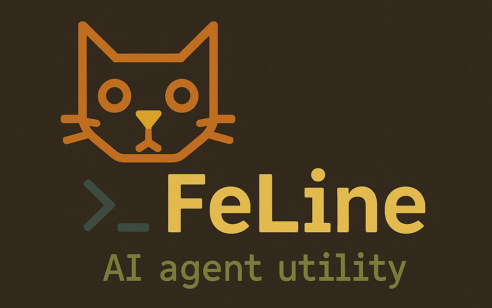

# 🐾 FeLine - Cliente de linea de comandos para modelos de IA generativos



---

# 📌 Introduccion

**FeLine** es una potente herramienta de linea de comandos (CLI) disenada para permitir una interaccion fluida y avanzada con modelos de lenguaje basados en inteligencia artificial.

Su principal fortaleza es la capacidad de **integrar directamente la salida de comandos del sistema** (Bash, PowerShell o CMD) dentro de una conversacion con la IA. Esto habilita escenarios dinamicos como:

- Obtener informacion del sistema en tiempo real  
- Analizar archivos locales  
- Procesar resultados de scripts  
- Traducir documentacion tecnica  
- Automatizar tareas usando lenguaje natural  

Todo dentro de un flujo conversacional natural y flexible.

---

# 🚀 Caracteristicas Principales

## 🔹 Integracion con comandos del sistema
Ejecuta comandos del terminal directamente dentro de tus prompts usando `$()` y envia su salida al modelo de IA.

## 🔹 Procesamiento de imagenes
Incluye archivos de imagen locales en tus consultas mediante `$[ruta/imagen.jpg]` para obtener descripciones o analisis visual.

## 🔹 Modo chat interactivo
Permite mantener conversaciones persistentes con el modelo seleccionado.

## 🔹 Seleccion flexible de modelos
Puedes elegir entre distintos modelos disponibles, por ejemplo:

- `**flash** gemini-2.5-flash`
- `**pro** gemini-2.5-pro`
- `**lite** gemini-2.5-flash-lite`

---

# 📋 Requisitos Previos

Antes de instalar FeLine, asegurese de cumplir con los siguientes requisitos:

## 1️⃣ Clave de API de Google AI Studio

- Obtener desde:  
  https://aistudio.google.com/app/apikey

- Esta clave es necesaria para autenticar FeLine con los modelos de IA.

## 2️⃣ Python 3

- Descargar desde:  
  https://www.python.org/downloads/

Se recomienda tener Python 3.10 o superior.

---

# ⚙️ Instalacion

Esta seccion describe como descargar el proyecto, configurar el entorno virtual e instalar las dependencias necesarias.

---

## 1️⃣ Descargar el Proyecto FeLine

### En sistemas Unix (Linux, macOS)

```bash
curl -L -o FeLine.zip https://github.com/vizard418/FeLine/archive/refs/heads/main.zip && \
unzip FeLine.zip -d . && mv FeLine-main FeLine && rm FeLine.zip
```

### En Windows (PowerShell)

```powershell
Invoke-WebRequest -Uri "https://github.com/vizard418/FeLine/archive/refs/heads/main.zip" -OutFile "FeLine.zip"; Expand-Archive -Path "FeLine.zip" -DestinationPath "FeLine" -Force; Remove-Item "FeLine.zip"
```

> Nota: En Windows se recomienda mover la carpeta `FeLine` a una ubicacion como:
>
> ```
> C:\Program Files\FeLine
> ```

---

## 2️⃣ Crear Entorno Virtual e Instalar Dependencias

Un entorno virtual evita conflictos con otras instalaciones de Python.

### Instalar virtualenv y crear entorno

```bash
python3 -m pip install virtualenv
cd FeLine/
python3 -m virtualenv env
```

### Activar entorno e instalar dependencias

#### En Unix

```bash
source env/bin/activate
python -m pip install -r requirements.txt
deactivate
```

#### En Windows

```powershell
env\Scripts\activate
python -m pip install -r requirements.txt
deactivate
```

---

## 3️⃣ Configurar la API Key y PATH

Para que FeLine funcione correctamente, debes configurar la variable de entorno `GEMINI_API_KEY` y agregar FeLine al `PATH`.

---

### En Linux / macOS

Agregar al archivo `~/.bashrc`, `~/.profile` o similar:

```bash
# FeLine - AI CLI Agent
export GEMINI_API_KEY="API_KEY_VALUE"
export PATH="$PATH:~/FeLine"
```

Luego recargar:

```bash
source ~/.bashrc
```

---

### En Windows

1. Buscar "Environment Variables" en el menu inicio.
2. Seleccionar "Edit the system environment variables".
3. Hacer clic en "Environment Variables...".
4. Crear una nueva variable:
   - Nombre: `GEMINI_API_KEY`
   - Valor: tu clave API.
5. Editar la variable `Path` y agregar la ruta completa donde esta instalado FeLine.

---

# ▶️ Uso Basico

Una vez instalado y configurado, puedes comenzar a utilizar FeLine.

---

## Iniciar modo interactivo

```bash
feline -it
```

Esto iniciara una sesion de chat persistente.

---

## Ver ayuda

```bash
feline --help
```

Muestra todas las opciones y parametros disponibles.

---

# 🧠 Uso Avanzado: Integracion con `$`

FeLine utiliza el simbolo `$` como prefijo especial para interactuar con el entorno local.

---

# 💻 Integracion con Comandos del Sistema

## Ejecutar comandos con `$()`

Permite ejecutar comandos del sistema y enviar su salida directamente al modelo.

### Ejemplo en Linux / macOS

```bash
feline "Resume el contenido de mis notas: $(cat notes.md)"
```

### Ejemplo en Windows

```cmd
feline "Resume el contenido de mis notas: $(type notes.md)"
```

---

## En Modo Interactivo

```bash
feline -it
> Resume el contenido del directorio actual: $(ls -l)
```

En Windows:

```cmd
> Resume el contenido del directorio actual: $(dir /a)
```

---

⚠️ **Advertencia Importante**

Ejecute unicamente comandos que comprenda completamente. Comandos destructivos pueden eliminar archivos o modificar el sistema.

---

# 🖼 Procesamiento de Imagenes

Use la sintaxis:

```
$[/ruta/a/imagen.jpg]
```

Ejemplo:

```bash
feline -it
> Describe esta imagen: $[/home/user/pictures/gato.jpg]
```

FeLine analizara la imagen y proporcionara una descripcion detallada.

Formatos soportados comunmente:

- .jpg
- .jpeg
- .png
- Otros formatos compatibles con el modelo

---

# 📚 Ejemplos de Uso

---

## 🗨 Chat Interactivo

```markdown
> Como funciona la inteligencia artificial?
```

Ideal para consultas generales, explicaciones tecnicas o aprendizaje.

---

## 🧩 Razonamiento Complejo

```markdown
> Explica la relacion entre cambio climatico y migracion humana con ejemplos concretos.
```

FeLine puede generar respuestas estructuradas y detalladas.

---

## 🖼 Reconocimiento y Conteo de Objetos

```markdown
> Cuantos animales ves en la imagen? $[/home/user/Downloads/animals.jpg]
```

El modelo analizara la imagen y listara los elementos detectados.

---

## 🔄 Integracion Comando + IA

Combina documentacion tecnica con capacidades del modelo:

```markdown
> Traduce al Klingon $(man chmod)
```

Este enfoque es util para:

- Traducir manuales
- Resumir logs
- Analizar configuraciones
- Explicar salidas de comandos

---

# 🎯 Casos de Uso Recomendados

- Administracion de sistemas
- Desarrollo de software
- Analisis de logs
- Automatizacion avanzada
- Analisis rapido de archivos locales
- Procesamiento de imagenes desde terminal

---

# 🏁 Conclusion

FeLine transforma la linea de comandos en un **agente conversacional inteligente**, permitiendo integrar el poder del sistema operativo con modelos avanzados de IA.

Gracias a su capacidad de ejecutar comandos y procesar imagenes dentro del flujo conversacional, se convierte en una herramienta ideal para usuarios tecnicos que desean aumentar su productividad directamente desde el terminal.

**La imaginacion es el limite.**

